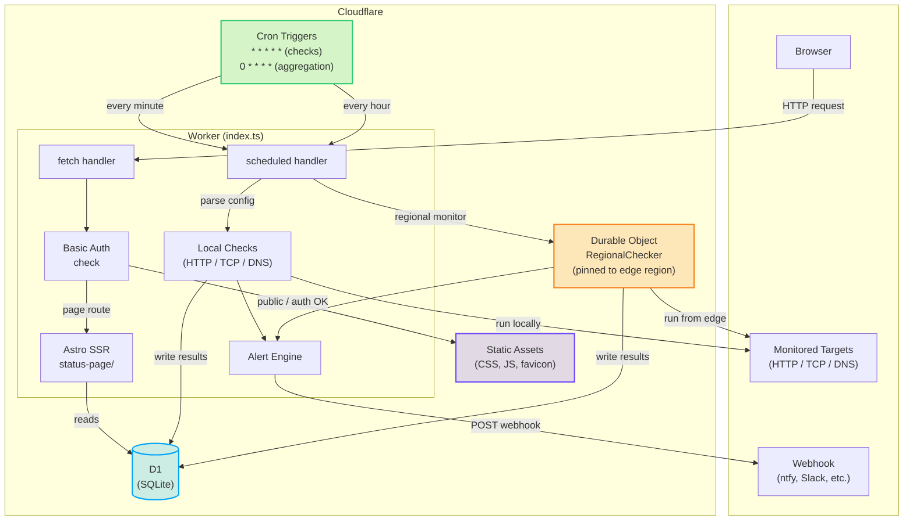

# Atalaya

Atalaya — Spanish for *watchtower* — is an uptime and status page monitor that runs entirely on
Cloudflare Workers and Durable Objects. It checks HTTP endpoints, TCP services, and DNS records on
a configurable schedule, stores the results in D1, and serves a public or password-protected status
page from the same Worker.

Cloudflare's free tier is generous enough to run this without cost for modest setups. The project
was built for hobbyists and anyone who wants to own their monitoring rather than paying for a SaaS
plan.

Most of the code was generated by an AI agent under supervision. The author had not written
TypeScript before, so you will find rough edges. It works. It has tests. Your mileage may vary.

Live instance: [uptime.ifconfig.es](https://uptime.ifconfig.es/)

## What it monitors

- HTTP and HTTPS endpoints — status code, response body assertions, custom headers
- TCP services — simple connection check on any port
- DNS records — verify expected values for A, AAAA, CNAME, and other record types

Any monitor can run from a specific geographic region — Western Europe, Eastern North America,
Asia Pacific, and more — using Durable Objects pinned to a Cloudflare edge location. See
[Regional Monitoring](regional-monitoring.md) for the full list of regions and configuration.

## What the status page shows

- Current status of every monitor
- 90-day uptime history with daily bars
- Response time charts (uPlot) with downtime bands
- Dark and light mode
- Basic auth or public access
- Custom banner image support with optional clickable link

## Architecture at a glance

The whole thing is a single Cloudflare Worker inside a pnpm workspace:

```
atalaya/
  src/           Monitoring engine, JSON API, auth, Astro SSR delegation
  status-page/   Astro 6 SSR site built into static assets
```

The Worker runs cron-triggered health checks, writes results to D1, enforces basic auth on
non-public routes, and serves the status page through Astro SSR. Regional checks are offloaded
to Durable Objects so they run from a specific Cloudflare edge location.

The status page accesses D1 directly. No service binding needed since everything lives in the same Worker.


